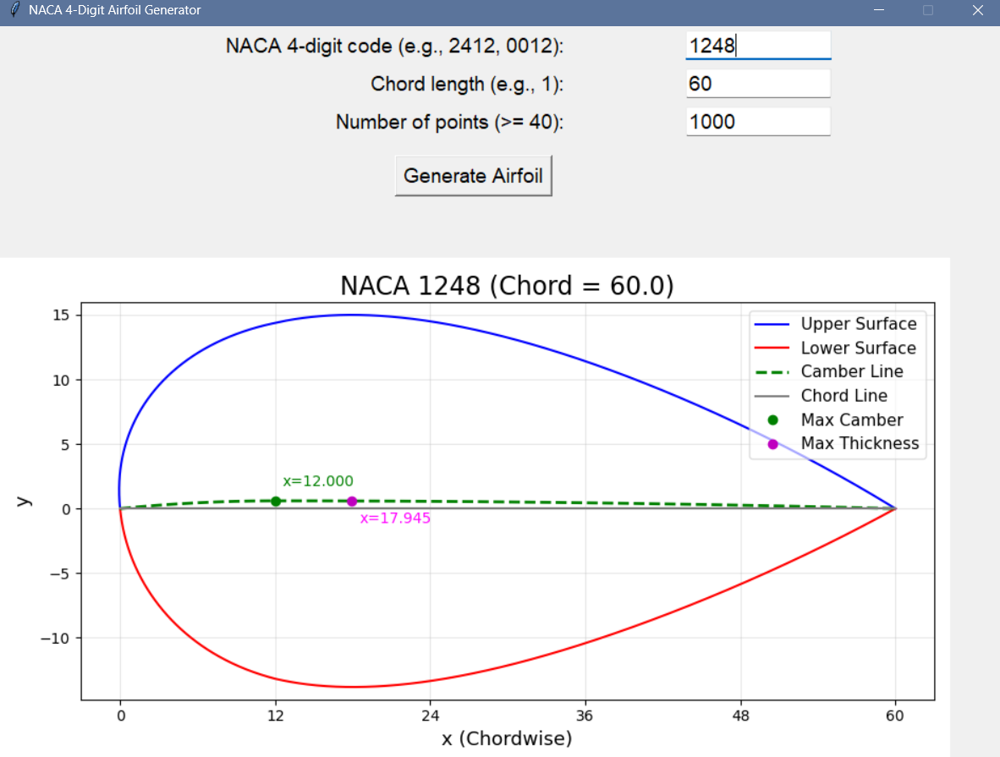

# NACA 4-Digit Airfoil Generator

An interactive desktop application built in Python for generating and visualizing NACA 4-digit airfoils.

---

## Features

- Interactive GUI using Tkinter
- Generate any NACA 4-digit airfoil
- Adjustable chord length
- Adjustable point resolution
- Camber line visualization
- Chord line visualization
- Maximum camber indicator
- Maximum thickness indicator
- Input validation
- Real-time plotting

---

## Technologies

- Python
- Tkinter
- NumPy
- Matplotlib

---

## Screenshots

### Welcome Screen


### Generated Airfoil



---

## Installation

```bash
pip install numpy matplotlib

python naca_airfoil_generator.py
```

## Future Improvements

- Export coordinates to CSV
- Save graph as PNG
- Compare multiple airfoils
- Dark mode
- 3D visualization

---

## Author

**Mehar Jamshaid**
