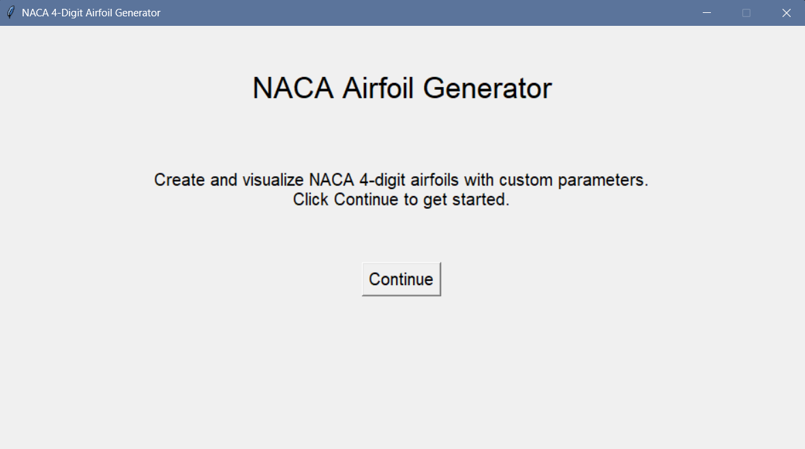

# NACA 4-Digit Airfoil Generator

An interactive desktop application built with **Python** that generates and visualizes NACA 4-digit airfoils using a graphical user interface (GUI).

This application allows users to input a NACA airfoil code, chord length, and point resolution to instantly generate an accurate airfoil profile based on the standard NACA equations. It also highlights important aerodynamic features including the camber line, maximum camber, and maximum thickness.

---

## Features

- Interactive graphical interface built with Tkinter
- Generate any NACA 4-digit airfoil
- Adjustable chord length
- Adjustable point resolution
- Real-time airfoil visualization
- Displays:
  - Upper surface
  - Lower surface
  - Camber line
  - Chord line
  - Maximum camber
  - Maximum thickness
- Built-in input validation and error handling
- Supports both symmetric and cambered airfoils

---

## Built With

- Python 3
- Tkinter
- NumPy
- Matplotlib

---

## Project Preview

### Welcome Screen



---

### Generated Airfoil


---

## Example

Input

NACA Code: 2412

Chord Length: 1

Points: 100

Output

- Airfoil geometry
- Camber line
- Chord line
- Maximum camber marker
- Maximum thickness marker

---

## Installation

Clone the repository

```bash
git clone https:/hunterpedia-mj/github.com//NACA-Airfoil-Generator.git
```

Navigate into the project

```bash
cd NACA Airfoil Generator
```

Install the required libraries

```bash
pip install -r requirements.txt
```

Run the application

```bash
python naca_airfoil_generator.py
```

---

## Future Improvements

- Export airfoil coordinates to CSV
- Save generated plots as PNG
- Compare multiple airfoils
- Modernized GUI
- Dark mode
- NACA 5-digit airfoil support
- Airfoil database
- 3D visualization

---

## Why I Built This

As an Aerospace Engineering student, I wanted to better understand how NACA airfoil parameters affect airfoil geometry. This project combines engineering principles with software development by providing an interactive visualization tool that makes aerodynamic concepts easier to explore.

---

## Repository Structure

```
NACA-Airfoil-Generator
│
├── naca_airfoil_generator.py
├── README.md
├── requirements.txt
├── LICENSE
│
├── screenshots
│   ├── welcome.png
│   └── airfoil.png
│
└── docs
```

---

## Author

**Mehar Jamshaid**

